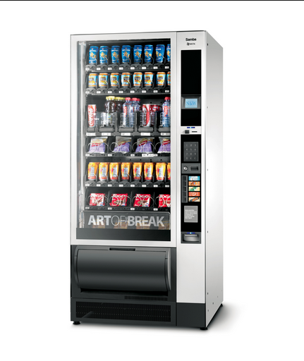

# Hipster IoC containers review kata
------------

Kata ma na celu zapoznanie się z wybranym przez siebie kontenerem IoC (eg. Guice, PicoContainer, Hk2, Dagger etc.). 
Ćwiczenia są zaprojektowane tak aby można było sprawdzić api wykorzystanego kontenera.  

1. Pobierz projekt
2. Przełącz się na odpowiedni brach (eg. team01) 
3. Czytaj historyjki, implementuj, odpalaj testy  

## 1.  Wrzuć monetę 
 
Automat przyjmuje monety, pierwsza wrzucona moneta rozpoczyna nową transakcję, transakcja zamyka się po wybraniu produktu i wpłaceniu odpowiedniej ilości pieniędzy lub po kliknięciu przycisku anuluj

*Hackaton tips:*

W paczce infrastructure znajdziesz klasę Application, jest w niej prywatna metoda createVendingMachine() powinna ona zwracać obiekt klasy VendingMachine. Spróbuj postawić prosty kontener i wstrzyknąć do niego obiekt tej klasy, następnie wyciągnij go z kontenera i zwróć w metodzie createVendingMachine(). Po uruchomieniu metody main() na standardowym wyjściu powinieneś zobaczyć napis „Insert coin”. VendingMachine powinno być singletonem.
Gdy już potrafisz postawić kontener w kodzie produkcyjnym zrób to samo w klasie testowej VendingMachineTest, test shouldCreateVendingMachineWithClosedTransaction() powinien być zielony.
W paczce domain znajdziesz interfejs TransactionFactory, dodaj implementację związaną z wybranym przez Ciebie kontenerem (eg. DaggerTransactionFactory), spróbuj zaimplementować metodę createTransaction bez wykorzystania słowa kluczowego new.
Wstrzyknij TransactionFactory do do klasy VendingMachine. Postaraj się aby testy z klasy Story1 były zielone.

Jeżeli nie chcesz skupiać swojej uwagi na implementowaniu klocków domenowych załączam przykładowe implementacje klas:

* [CoinBank](https://gist.github.com/pawelszymczyk/ab9b431d3b9e8ea93f72)
* [ProductStorage](https://gist.github.com/pawelszymczyk/19306dcb8803c514c689)
* [VendingMachine](https://gist.github.com/pawelszymczyk/6798008f54096dfa87be)

## 2. Wybierz produkt

Jeżeli użytkownik wrzucił odpowiednią ilość pieniędzy maszyna wydaje wybrany produkt - umieszcza go na tacy (Products Tray) z której zabiega go użytkownik. Maszyna powiadamia serwisantów o o braku poszczególnych produktów, możliwe formy powiadamiania to: mail, sms, ticket na jira. W przypadku braku produktu ticket na jira oraz mail na alias.

*Hackaton tips:*

Wszystkie klasy odpowiadające za powiadomienie implementują ten sam interfejs ServiceNotifier, do klasy ProductStorage listę beanów implementacych ServiceNotifier - JiraServiceNotifier oraz MailServiceNotifier.

## 3. Zwróć resztę

Po wybraniu produktu maszyna umieszcza na tacy (Coin Return Tray) różnicę pomiędzy wartością produktu a sumą monet wrzuconych przez użytkownika. Maszyna powiadamia o braku pieniędzy do wydawania - wysyła mail na wskazany adres oraz zakłada ticket w Jira.

*Hackaton tips*

Do klasy CoinBank wstrzyknij konkretną implementację ServiceNotifier - SmsServiceNotifier.

## 4. Zewnętrzny magazyn produktów

Nasz nowy klient (SunCorp) wymaga aby maszyna miała możliwość podłączenia zewnętrznego magazynu produktów. Zewnętrzne magazyny muszą mice dostęp do standardowych powiadamiaczy – JiraServiceNotifier oraz MailServiceNotifier. Przeprowadź wdrożenie maszyny w SunCorp, firma ma swój własny magazyn produktów (SunCorpProductStorage), dostosuj go do wymagań VendingMachine, zainstaluj w maszynie i uruchom.

*Hackaton tips*

Zmień klasę ProductStorage na interfejs, implementację metod przenieś do DefaultProductStorage. Zmodyfikuj klasę SunCorpProductStorage tak aby implementowała interfejs ProductStorage. Uruchom VendingMachine z SunCorpProductStorage. Zwróć uwagę na to w jaki sposób udostępnisz beany JiraServiceNotifier oraz MailServiceNotifier potrzebne do zbudowania obiektu SunCorpProductStorage. Test Story4 powinien być zielony.

## 5. Logowanie

Jako serwisant chciałbym mieć log ostatnich akcji w maszynie (wrzucone pieniądze, wybrane produkty)

*Hackaton tips*

Nie chcemy mieszać w naszej domenie i dodawać wywołań loggera w każdej metodzie, spróbuj posłużyć się wzorcem proxy, rozwiązać zadanie w stylu aspektowym.            

---------------------

Stories based on: http://github.com/guyroyse/vending-machine-kata